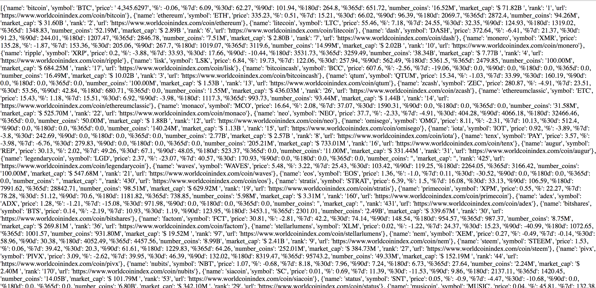

Local Cryptocurrency API
---

### What does this program do?
Retrieves and serves the latest cryptocurrency price, marketcap, and price change data from: <a href='https://www.worldcoinindex.com'>https://www.worldcoinindex.com</a>
 
Serves the coin data as an api route available on port 8001.

#### To run:
* pip install -r requirements.txt
* python crypto-api.py
* Visit: localhost:8001/coins

<b>Example response:</b> 

